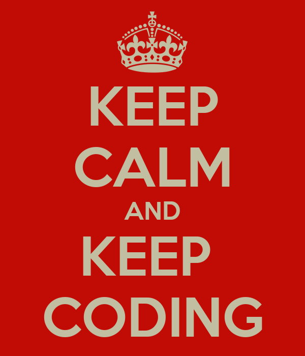

<!-- Please update value in the {}  -->

<h1 align="center">404 Not Found</h1>

   Solution for a challenge from  <a href="http://devchallenges.io" target="_blank">Devchallenges.io</a>.

  <h3>
    <a href="https://{your-demo-link.your-domain}">
      Demo
    </a>
     | 
    <a href="https://{your-url-to-the-solution}">
      Solution
    </a>
     | 
    <a href="https://devchallenges.io/challenges/wBunSb7FPrIepJZAg0sY">
      Challenge
    </a>
  </h3>

<!-- TABLE OF CONTENTS -->

## ✔️ Table of Contents

- [Overview](#overview)
  - [Built With](#built-with)
- [Features](#features)
- [Contact](#contact)
- [Acknowledgements](#acknowledgements)

<!-- OVERVIEW -->

## ✨ Overview

The project consists of a creation of a 404 page not found being the design responsive.

### 🐧 My impression

This project took a lot of attention to detail, since to deal with a responsive layout I have to make several changes and concepts that I didn't use before. The challenge motivated me to look for more about good practices within CSS, how much responsiveness and meaning to the user. Overall I conclude that I have a long way to go and a lot of content to learn!

## 💻 Demonstration

  <a href="https://404-not-found-six-wheat.vercel.app/" alt="Site teste">
    <image src=".github/netlify.png" alt="netlify">
  </a>

### 🚀 Built With

<!-- This section should list any major frameworks that you built your project using. Here are a few examples.-->

   
    

## ⚛️ Features

<!-- List the features of your application or follow the template. Don't share the figma file here :) -->

This application/site was created as a submission to a [DevChallenges](https://devchallenges.io/challenges) challenge. The [challenge](https://devchallenges.io/challenges/wBunSb7FPrIepJZAg0sY) was to build an application to complete the given user stories.

## 📚 Acknowledgements

<!-- This section should list any articles or add-ons/plugins that helps you to complete the project. This is optional but it will help you in the future. For exmpale -->

- [Steps to replicate a design with only HTML and CSS](https://devchallenges-blogs.web.app/how-to-replicate-design/)

## 🔗 Contact

- GitHub [@jonbrand](https://github.com/jonbrand)
- Linkedin [@Jonatas Brandão](https://www.linkedin.com/in/jonatas-brand%C3%A3o/)

## 📝 Licença

Esse projeto está sob a licença MIT. Veja o arquivo [LICENSE](.github/LICENSE.md) para mais detalhes.

---

  

